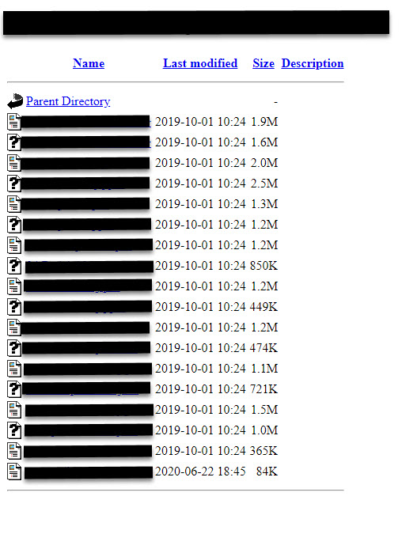

# IWE

IWE (/ˈaɪvɪ/) (aka I Want Everything) is program developed for downloading multiple files from server/HTTP directory (as showed in **[picture 1](###picture-1)**). It will download everything from given url (including all subfolders). It should be able to handle any webpage and download everything linked on it (this is not tested) but since it follows links it could download something you didnt expect to. 

The application asks you for:  
- *path* where you want to save files you are trying to download (path can be ommited and then application will download files to default path) 
- *url* of the wanted webpage  
- *extension*, which if you provide will enable application to download only files with given extension (extension can be ommited and then application will download all files)

There are terminal and gui version *.exe* files provided.

### Picture 1

## Usage

Download *IWE terminal* or *IWE gui* application.
Start the application (double click it). Executable files are made for *Windows*.

In *IWE terminal*:  
- just follow the instructions  

In *IWE gui*:  
- enter **path**, **url**, **extension** you want  
- click **Prepare** button
- click **Download** button
- after download is finished, you can change parameters, click **Prepare** button, click **Download** button to start downloading something else you want

## Known bugs and problems

GUI version of application gets laggy (unresponsive) during downloading (it doesnt stop downloading or anything, it just gets laggy).

## Version

0.1

## Contact

For any questions and suggestions, send email to *lakiwow95[at]gmail.com*